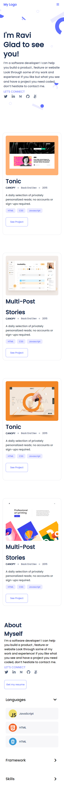

# Project Name
My_Portfolio_Website Using Flexbox

> One paragraph statement about the project.

Additional description about the project and its features.

## Built With

HTML and CSS
Using Grid and Flexbox , forms etc
Javascript : Arrays and Objects
Local Storage
Form Validation etc

## Live Demo

[Live Demo Link](https://ravitejam9602.github.io/Portfolio/)

## Getting Started

**This is an example of how you may give instructions on setting up your project locally.**

To get a local copy up and running follow these simple example steps.

### Prerequisites
Grid, Flexbox, Images (Concepts in CSS)
### Setup
Linter Setup 

## Authors

👤 **Author1**

- GitHub: [@githubhandle](https://github.com/RaviTejaM9602/Portfolio)
- Twitter: [@twitterhandle](https://twitter.com/RaviTejaMekala1)
- LinkedIn: [LinkedIn](https://www.linkedin.com/in/ravi-teja-8499a31b9/)

## 🤝 Contributing

Contributions, issues, and feature requests are welcome!

Feel free to check the [issues page](../../issues/).

## Show your support

Give a ⭐️ if you like this project!

## Acknowledgments

Microverse

## 📝 License

This project is [MIT](./MIT.md) licensed.
Ravi Teja

